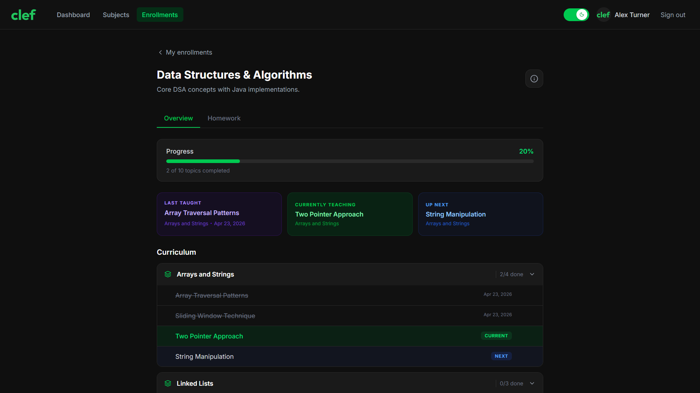
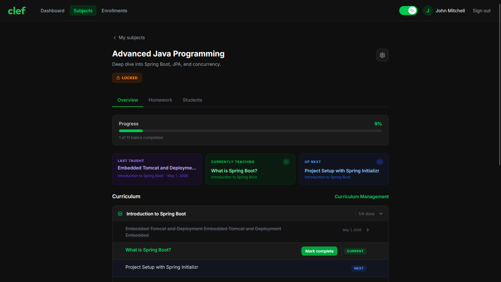
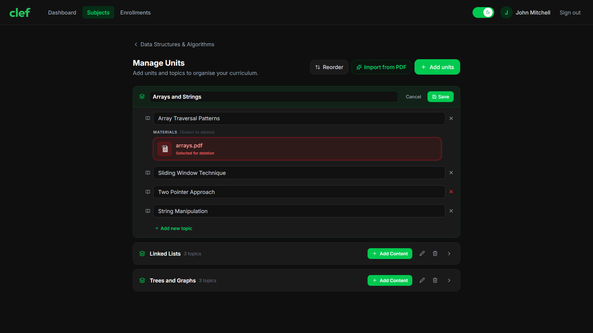
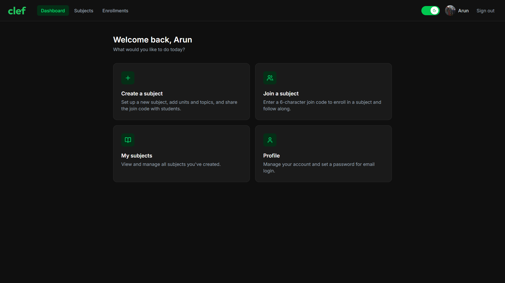
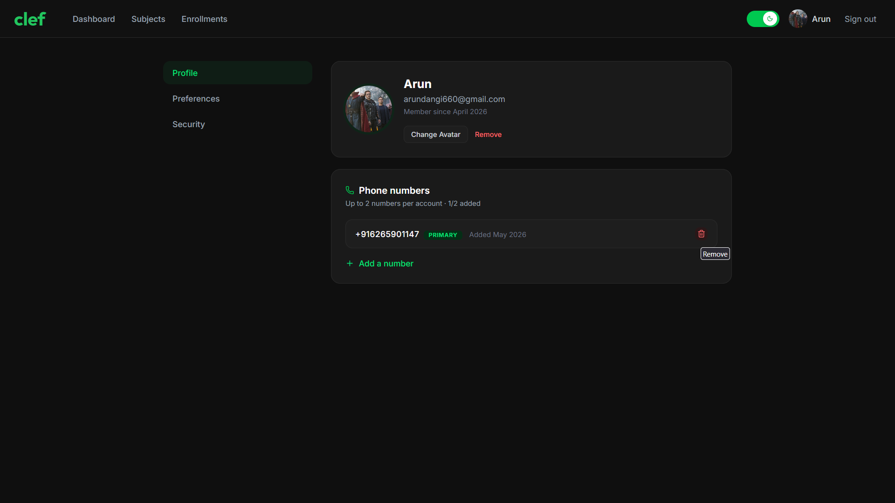
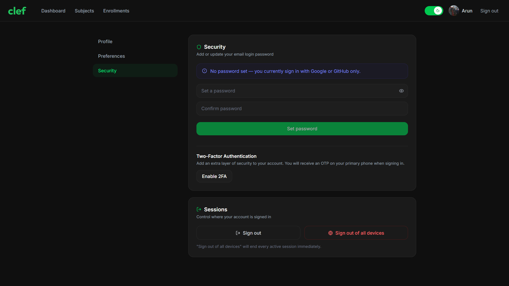

# Clef

**Keep your class in sync** — a teaching and course management platform that gives every student a live view of where the class is, what is being covered, and what comes next.

[](https://openjdk.org/)
[](https://spring.io/projects/spring-boot)
[](https://www.postgresql.org/)
[](https://ai.google.dev/)

**Live Demo:** [https://clefapp.vercel.app](https://clefapp.vercel.app) 
> Live demo note: SMS OTP is simulated because of Twilio free tier limitations — enter the last 6 digits of your phone number to verify.

---

## Overview

Clef was built to solve a problem I experienced firsthand. After returning to college from a long health leave, I had no way to know which topics had been covered, what came next, what the homework was, or where to even begin catching up. No idea where to start, no notes — nothing. I built Clef so that no student ever has to face that situation again.

Clef gives every enrolled student a real-time view into their class. A teacher creates a subject, loads the syllabus (manually or through the built-in AI parser), sets what topic is currently being taught and what is coming next, marks topics as complete, and uploads study material per topic. The "current and next topic" pointers auto-advances whenever a topic is marked complete, so the class view is always accurate without any extra effort from the teacher.

The platform uses a context-derived role model — there are no hardcoded global roles. A user who creates a subject becomes its teacher. A user who joins via the 6-character invite code becomes a student of that subject. The same user can be a teacher in one subject and a student in another simultaneously. This makes the system flexible and mirrors how real academic life works.

---

## Features

### Subject & Curriculum Management
- Create subjects with an auto-generated 6-character join code
- Update subject name and description
- Lock a subject to prevent new enrollments
- Archive subjects to declutter the dashboard
- Upload a syllabus PDF per subject; students and teachers can view it
- Manually add units and topics, or use the AI parser to extract them from the syllabus
- Bulk-create units and topics from the parsed or manually composed structure
- Reorder units and topics using indexed sequencing (supports drag-and-drop on the frontend)
- Update or delete individual units and topics
- Toggle topic completion; the current/next topic pointer auto-advances on completion

### Progress Tracking
- Teacher explicitly sets the current topic being taught and the next upcoming topic
- Auto-advancement: when the current or next topic is marked complete, the pointer moves forward automatically
- Students can see the full curriculum structure, the current topic, and the upcoming topic at all times

### Content Delivery
- Teachers upload per-topic materials: PDF, image, video, audio, and document files
- Backend validates file size before accepting the upload
- Files are stored in Supabase object storage via the AWS S3 SDK
- Pre-signed URLs with a 1-hour TTL are generated on demand for time-scoped, direct client access
- Materials can be deleted individually or in bulk

### Homework
- Teachers create homework entries with a title, description, due date, and linked topics
- Homework is paginated and filterable (upcoming / all)
- Students see the homework entries so they know what is expected — no submission or tracking required

### Authentication
- Sign in with Google or GitHub via OAuth2
- Email and password login as an alternative
- Set a password from the profile page (for users who want a local credential)
- Update password using the old password as confirmation
- Forgot password: re-authenticate through OAuth2 to set a new password without needing the old one
- JWT-based session management: access token returned in response body (stored in memory by the client) and refresh token set as an HttpOnly cookie, with rotation on every refresh
- Per-device logout (invalidates only the current refresh token)
- All-sessions logout (invalidates all refresh tokens for the account)

### Two-Factor Authentication (2FA)
- Attach a verified phone number to the account
- Enable SMS-based 2FA powered by Twilio Verify
- At login, users with 2FA enabled receive a 6-digit OTP on their registered primary number
- OTP verification is required before a session is issued (access token + refresh token)

### User Profile
- Upload or remove a profile picture (stored in a public Supabase bucket)
- Add and verify a phone number via OTP, two phone numbers allowed at max; set secondary number as primary if needed
- Toggle phone number visibility to students
- Toggle teacher and student dashboard section visibility if you only use one, to minimize distraction
- Teacher profiles are accessible to enrolled students (name, avatar, optionally phone)

### Enrollment Management
- Students join a subject using the 6-character code
- Teachers can view the full list of enrolled students
- Teachers can remove individual students from a subject
- Students can unenroll themselves at any time

### AI Syllabus Parser
- Teacher uploads a syllabus PDF to the subject
- On request, the backend sends the syllabus to Gemini AI via a direct REST call
- Gemini extracts and returns a structured list of units and their topics as JSON; the backend parses and maps it to DTOs before returning to the frontend
- The teacher reviews and edits the result before confirming bulk unit creation
- Nothing is written to the database until the teacher explicitly approves

---

## Tech Stack

### Backend
| Layer | Technology |
|---|---|
| Language | Java 21 |
| Framework | Spring Boot 3.5.8 |
| Security | Spring Security, OAuth2 Client |
| Auth Tokens | JJWT 0.12.6 |
| API Documentation | SpringDoc OpenAPI (Swagger UI) |
| Object Mapping | MapStruct 1.6.3 |
| Validation | Jakarta Bean Validation |
| Utilities | Lombok, Apache Commons Lang3 |
| Caching | Spring Cache + Caffeine |

### Infrastructure & Integrations
| Layer | Technology                                            |
|---|-------------------------------------------------------|
| Database | PostgreSQL                                            |
| DB Migrations | Flyway                                                |
| File Storage | Supabase (accessed via AWS SDK for Java v2 S3 client) |
| SMS / 2FA | Twilio Verify                                         |
| Phone Parsing | libphonenumber                                        |
| AI | Google Gemini (direct REST)                           |
| Containerization | Docker (multi-stage build)                            |
| Deployment | Render                                                |

### Frontend (separate repository section)
| Layer | Technology |
|---|---|
| Framework | React 19 + Vite |
| Routing | React Router v7 |
| Data Fetching | TanStack Query v5 |
| Drag and Drop | dnd-kit |
| Styling | Tailwind CSS v4 |
| Deployment | Vercel |

---

## Architecture

### Context-Derived Role System
When a user creates a subject, the system records them as the owner. When a user joins via the invite code, an enrollment record is created. Every protected action checks whether the requesting user is the owner (teacher) or an enrolled member (student) of that specific subject. The same user account can hold both roles across different subjects with no additional configuration.

### Authentication Flow
```
OAuth2 Login (Google / GitHub)
        |
        v
  Spring Security OAuth2 Client
        |
        v
  Custom OAuth2 Success Handler
        |-- 2FA enabled? --> issue tempToken cookie --> redirect to /2fa-verify
        |
        v
  Issue access token (Bearer) + refresh token (HttpOnly cookie)
        |
        v
  Client uses access token for API calls; refresh endpoint rotates both tokens
```

For email/password login the same branching logic applies — if 2FA is active, a temporary token is issued first and a full session is only granted after OTP verification.

The password-reset flow redirects the user through OAuth2, sets a `password-reset-intent` cookie to signal intent, and on completion issues a short-lived access token that the reset form uses to call `POST /auth/password/set`. This means a user who has forgotten their password can always recover access as long as their OAuth2 provider account is intact, without any email-based reset link.

### File Storage
All uploads go through the backend. The backend validates the file (size limits enforced), uploads to Supabase via the AWS S3 SDK, stores the object key in the database, and discards the raw bytes. When a client needs to access a file, the backend generates a pre-signed URL with a 1-hour TTL and returns it. The client calls Supabase directly using that URL, so file traffic never passes through the backend again.

Two buckets are used: `clef-files` (private) for topic materials and syllabus PDFs, and `clef-avatars` (public) for profile pictures.

### Database Migrations
All schema changes are managed via Flyway. Migration scripts live in `src/main/resources/db/migration` and run automatically on startup.

### Caching
Caffeine is used as the in-process cache provider via Spring Cache. Cached data is invalidated on the relevant write operations.

### API Layer
All endpoints are prefixed with `/api` (configured via `server.servlet.context-path`). The application runs on port `8081` by default. A full interactive Swagger UI is available at `/api/swagger-ui/index.html` in development.

---

## Getting Started

### Prerequisites
- Java 21
- Maven 3.9+
- PostgreSQL database
- A Google OAuth2 application (for Google login)
- A GitHub OAuth2 application (for GitHub login)
- A Twilio account with a Verify service (for 2FA and phone verification)
- A Supabase project with S3-compatible storage enabled
- A Gemini API endpoint URL (Google AI Studio)

### Environment Variables

Copy `.env.example` to `.env` and fill in all values.

```env
# Application
SPRING_PROFILES_ACTIVE=dev
PORT=8081

# Frontend (used for OAuth2 redirect URIs and CORS)
FRONTEND_URL=http://localhost:5173

# Database
DB_URL=jdbc:postgresql://localhost:5432/clef

# JWT
JWT_SECRET=<a-long-random-base64-string>
JWT_ACCESS_COOKIE_EXPIRATION=15m
JWT_REFRESH_COOKIE_EXPIRATION=7d
JWT_TEMP_COOKIE_EXPIRATION=5m
JWT_PASSWORD_RESET_INTENT_COOKIE_EXPIRATION=5m

# OAuth2
GOOGLE_CLIENT_ID=
GOOGLE_CLIENT_SECRET=
GITHUB_CLIENT_ID=
GITHUB_CLIENT_SECRET=

# Twilio
TWILIO_ACCOUNT_SID=
TWILIO_AUTH_TOKEN=
TWILIO_SERVICE_SID=

# Gemini
GEMINI_API_URL=

# Supabase (S3-compatible)
SUPABASE_ACCESS_KEY=
SUPABASE_SECRET_KEY=
```

> The Supabase endpoint, public URL, region, and bucket names are hardcoded in `application.yaml`. If you are self-hosting, update those values before running.

### OAuth2 Redirect URIs

Register the following redirect URIs in your Google and GitHub OAuth app settings:

```
http://localhost:5173/api/login/oauth2/code/google
http://localhost:5173/api/login/oauth2/code/github
```

In production, replace `http://localhost:5173` with your deployed frontend URL.

### Running Locally

```bash
# Clone the repository
git clone https://github.com/Enigmazer/clef-backend.git

# Copy and populate the environment file
cp .env.example .env
# Edit .env with your credentials

# Run with Maven wrapper
./mvnw spring-boot:run
```

The API will be available at `http://localhost:8081/api`.
Swagger UI will be available at `http://localhost:8081/api/swagger-ui/index.html`. Swagger is disabled in production intentionally.

### Running with Docker

```bash
# Build the image
docker build -t clef-backend .

# Run the container (pass env vars from your .env file)
docker run --env-file .env -p 8081:8081 clef-backend
```

---

## API Overview

All routes are prefixed with `/api`. Authentication uses a Bearer access token in the `Authorization` header for stateless clients. The browser client uses an HttpOnly `refreshToken` cookie for session continuity.

### Authentication — `/auth`
| Method | Path | Description |
|---|---|---|
| POST | `/auth/login` | Login with email and password |
| POST | `/auth/refresh` | Rotate access and refresh tokens |
| POST | `/auth/logout` | Invalidate the current session |
| POST | `/auth/logout-all` | Invalidate all sessions for the account |

### Two-Factor Authentication — `/auth/2fa`
| Method | Path | Description |
|---|---|---|
| POST | `/auth/2fa/send-otp` | Send an OTP to the registered phone number |
| POST | `/auth/2fa/verify` | Verify OTP and complete login |
| PATCH | `/auth/2fa/enable` | Enable 2FA on the account |
| PATCH | `/auth/2fa/disable` | Disable 2FA on the account |

### Password — `/auth/password`
| Method | Path | Description |
|---|---|---|
| POST | `/auth/password/set` | Set a password (first time) |
| PATCH | `/auth/password/update` | Update password using the old password |
| GET | `/auth/password/reset/oauth2/init` | Start the OAuth2-based password reset flow |

### User — `/users`
| Method | Path | Description                                   |
|---|---|-----------------------------------------------|
| GET | `/users/me` | Get the current user's profile                |
| PATCH | `/users/avatar` | Upload a profile picture                      |
| DELETE | `/users/avatar` | Remove the profile picture                    |
| PATCH | `/users/preferences/phone-visibility/toggle` | Toggle phone visibility to students           |
| PATCH | `/users/preferences/student-section-visibility/toggle` | Toggle student section visibility on frontend |
| PATCH | `/users/preferences/teacher-section-visibility/toggle` | Toggle teacher section visibility on frontend |

### Phone — `/phone`
| Method | Path | Description |
|---|---|---|
| POST | `/phone/send-otp` | Send an OTP to verify a phone number |
| POST | `/phone/verify-otp` | Verify OTP and register the phone number |
| GET | `/phone` | List the user's registered phone numbers |
| POST | `/phone/set-primary` | Promote a secondary number to primary |
| DELETE | `/phone/delete` | Remove a phone number |

### Subjects — `/subjects`
| Method | Path | Description |
|---|---|---|
| POST | `/subjects` | Create a subject |
| GET | `/subjects/teacher` | List all active subjects owned by the teacher |
| GET | `/subjects/teacher/archived` | List archived subjects owned by the teacher |
| GET | `/subjects/{id}/teacher` | Get subject details (teacher view) |
| PATCH | `/subjects/{id}` | Update subject name or description |
| PATCH | `/subjects/{id}/preferences/lock/toggle` | Toggle enrollment lock |
| PATCH | `/subjects/{id}/preferences/archive/toggle` | Toggle archive state |
| DELETE | `/subjects/{id}` | Delete a subject |
| PATCH | `/subjects/{id}/current-topic` | Set the current topic |
| PATCH | `/subjects/{id}/next-topic` | Set the next topic |
| GET | `/subjects/student` | List subjects the student is enrolled in |
| GET | `/subjects/{id}/student` | Get subject details (student view) |
| GET | `/subjects/{id}/teacher/profile` | Get the teacher's public profile |
| POST | `/subjects/join` | Join a subject using the 6-character code |

### Syllabus — `/subjects/{id}/syllabus`
| Method | Path | Description |
|---|---|---|
| GET | `/subjects/{id}/syllabus` | Get the syllabus pre-signed URL |
| PUT | `/subjects/{id}/syllabus` | Upload a syllabus PDF |
| DELETE | `/subjects/{id}/syllabus` | Remove the syllabus |
| GET | `/subjects/{id}/syllabus/parse` | Parse the syllabus via Gemini AI |

### Units — `/subjects/{id}/units`
| Method | Path | Description |
|---|---|---|
| POST | `/subjects/{id}/units/bulk` | Bulk create units with their topics |
| PATCH | `/subjects/{id}/units/{unitId}` | Update a unit title or add new topics |
| PATCH | `/subjects/{id}/units/reorder` | Reorder units and their topics |
| DELETE | `/subjects/{id}/units/{unitId}` | Delete a unit |

### Topics — `/subjects/{id}/units/{unitId}/topics`
| Method | Path | Description |
|---|---|---|
| PATCH | `/subjects/{id}/units/{unitId}/topics` | Update topic titles in bulk |
| PATCH | `/subjects/{id}/units/{unitId}/topics/{topicId}/complete/toggle` | Toggle topic completion |
| DELETE | `/subjects/{id}/units/{unitId}/topics` | Delete topics in bulk |

### Topic Materials — `/subjects/{id}/units/{unitId}/topics/{topicId}/topic-materials`
| Method | Path | Description |
|---|---|---|
| POST | `...topic-materials` | Upload a file for the topic |
| GET | `...topic-materials/{id}` | Get the pre-signed URL |
| DELETE | `...topic-materials` | Delete one or more materials |

### Homework — `/subjects/{id}/homework`
| Method | Path | Description |
|---|---|---|
| POST | `/subjects/{id}/homework` | Create a homework entry |
| GET | `/subjects/{id}/homework` | List homework (paginated, filterable) |
| PATCH | `/subjects/{id}/homework/{id}` | Update a homework entry |
| DELETE | `/subjects/{id}/homework/{id}` | Delete a homework entry |

### Enrollments — `/subjects/{id}/enrollments`
| Method | Path | Description |
|---|---|---|
| GET | `/subjects/{id}/enrollments` | List enrolled students (teacher only) |
| DELETE | `/subjects/{id}/enrollments/{studentId}` | Remove a student (teacher only) |
| DELETE | `/subjects/{id}/enrollments` | Self-unenroll from the subject (student) |

---

## Screenshots

1. **Subject Detail — Student View**


2. **Subject Detail — Teacher View**


3. **Curriculum Manager (Units Page)**


4. **Dashboard**


5. **Profile / Security Section**



---

## Roadmap

- **Magic byte file validation** — validate actual file content (not just MIME type or extension) before accepting uploads, to prevent disguised malicious files
- **Topic resource links** — allow teachers to attach external URLs (articles, YouTube lectures, documentation) alongside uploaded files for a topic
- **Analytics for administrators** — give principals and department heads a read-only dashboard showing curriculum progress across all subjects, highlighting classes that are falling behind

---

## Author

**Arun Dangi** [LinkedIn Profile](https://www.linkedin.com/in/arundangi)  
Email: [arundangi660@gmail.com](mailto:arundangi660@gmail.com)

---

## License
© 2026 Arun Dangi. All rights reserved.